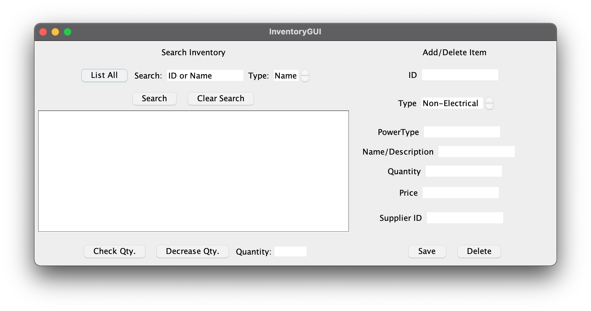
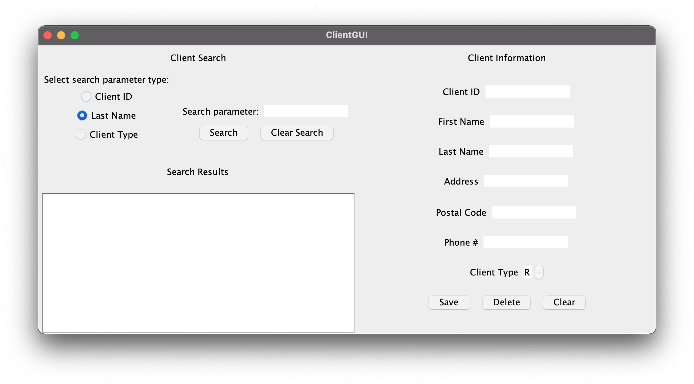

# Inventory-Management-App

## Authors

- Lotfi Hasni
- Hunter Kimmett

## Introduction

The goal of this project was to create a GUI using Java allowing for a user to check prices, add, modify, delete, sell and order new inventory items as well as add, modify, delete and check on suppliers. These databases are stored in an SQL database which is modified by the App. The project is divided into 3 packages:

- Pre-Excercise: Connects to the SQL database and then imports information from text files.
- Server: Accesses and  modifies SQL database based on messages from Client. Can be run on a different device than the Client.
- Client: Runs GUI for user to view/edit SQL database on Server side using messages. Can be run on a different device than Server.

## Contents

The following projects contain the packages required for the project requirements.

### Pre-Exercise

This project contains the necessary code in the preExercise package as well as the commonModel and message packages as helpers.

- preExercise
- commonModel
- message

### Server

This project contains the necessary packages to run the server, as well as the ShopDB.sql file to import the SQL database.

- serverController
- commonModel
- message

### Client

This project contains the necessary packages to run the client.

- clientController
- clientView
- commonModel
- message

## Pre-Exercise

In order for the pre-exercise programs to be run, SQL login info variables must be changed to the user's setup variables. These variables are:

IDBCredentials.java:

- DB_URL 		= "jdbc:mysql://localhost:3306/demo"		(default value)
- USERNAME 	= "root"									(default value)
- PASSWORD		= "zgmfx09a"								(default value)

InventoryManager.java:
- connectionInfo = "jdbc:mysql://localhost:3306/InventoryDB"        (default value)
- login                 = "root"									(default value)
- password         = "zgmfx09a"								(default value)

Once these variables are set to the same values of your system, the program can be run.

## Setup

There are two programs to be run - the client and the server.

In order for the server to run, an SQL database needs to be imported.

Please import the ShopDB.sql into a database (by default we called ours "ENSF608Project", it can be named something else) using a program such as mySQL Workbench.

Once the database is imported, variables may need to be changed within the program in order to accommodate your SQL login info. These variables are:

serverController.DatabaseController.java:
- databaseName	= "ENSF608Project"	(default value)
- login 			= "root"				(default value)
- password 		= "zgmfx09a"			(default value)

For the client to run, if the server is on a local machine no change needs to be made. To run with a server on another machine, change the variable "ip" in clientController.MainClientController.java to the IP Address of the server machine.

## Run Program

To run the program, first run the server program serverController.ModelController.java. Next, run the start.LoginGUI program.

The program will give a login window asking for credentials. Currently a valid username is "user" and a valid password is "pass". Enter this information and a new window will open, prompting you to either open the customer database manager or the tool database manager.

These programs allow for the searching, updating, adding, and deletion of tools and customers.

## Program In Action

Inventory GUI:

Supplier GUI:

